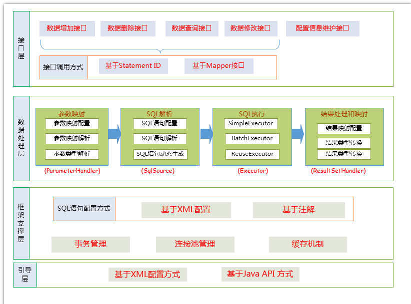
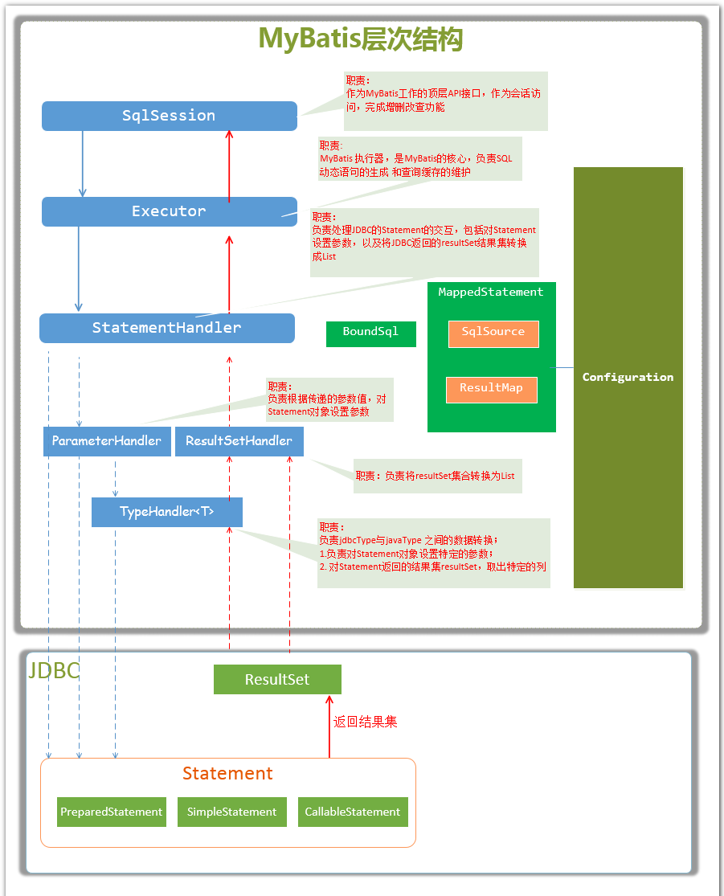

# Mybatis学习笔记

## Mybatis 简介

1. MyBatis 是一款优秀的持久层框架，它支持定制化 SQL、存储过程以及高级映射。
2. MyBatis 避免了几乎所有的 JDBC 代码和手动设置参数以及获取结果集。
3. MyBatis 可以使用简单的 XML 或注解来配置和映射原生信息，将接口和 Java 的 POJOs(Plain Old Java Objects,普通的 Java对象)映射成数据库中的记录。

## Mybatis架构设计

### Mybatis架构设计图



### 功能架构讲解

1. API接口层：提供给外部使用的接口API，开发人员通过这些本地API来操纵数据库。接口层一接收到调用请求就会调用数据处理层来完成具体的数据处理。
2. 数据处理层：负责具体的SQL查找、SQL解析、SQL执行和执行结果映射处理等。它主要的目的是根据调用的请求完成一次数据库操作。
3. 基础支撑层：负责最基础的功能支撑，包括连接管理、事务管理、配置加载和缓存处理，这些都是共用的东西，将他们抽取出来作为最基础的组件。为上层的数据处理层提供最基础的支撑。

## Mybaits 初始化流程

1. 调用SqlSessionFactoryBuilder对象的build(inputStream)方法；
2. SqlSessionFactoryBuilder会根据输入流inputStream等信息创建XMLConfigBuilder对象;
3. SqlSessionFactoryBuilder调用XMLConfigBuilder对象的parse()方法；
4. XMLConfigBuilder对象返回Configuration对象；
5. SqlSessionFactoryBuilder根据Configuration对象创建一个DefaultSessionFactory对象；
6. SqlSessionFactoryBuilder返回 DefaultSessionFactory对象给Client，供Client使用。

## Mybatis执行流程



## Mybatis 配置讲解

### mybatis-config.xml 配置

```xml
<?xml version="1.0" encoding="UTF-8" ?>
<!DOCTYPE configuration
        PUBLIC "-//mybatis.org//DTD Config 3.0//EN"
        "http://mybatis.org/dtd/mybatis-3-config.dtd">
<configuration>
    
    <settings>
        <setting name="logImpl" value="LOG4J "/>
    </settings>
    
    <!--实体类别名设置-->
    <typeAliases>
        <package name="top.simba1949.common"/>
    </typeAliases>

    <!-- 插件(略) -->
    
    <!--配置环境-->
    <environments default="development">
        <environment id="development">
            <!--事务管理的配置 -->
            <transactionManager type="JDBC"></transactionManager>
            <!--数据源的配置-->
            <dataSource type="POOLED">
                <property name="driver" value="${driver}"/>
                <property name="url" value="${url}"/>
                <property name="username" value="${username}"/>
                <property name="password" value="${password}"/>
            </dataSource>
        </environment>
    </environments>

    <!--映射器（mappers）-->
    <mappers>
        <package name="top.simba1949.mapper"/>
    </mappers>
</configuration>
```

#### settings

> 见 http://www.mybatis.org/mybatis-3/zh/configuration.html#settings

| 设置参数                         | 描述                                                         | 有效值                                                       | 默认值                                                |
| -------------------------------- | ------------------------------------------------------------ | ------------------------------------------------------------ | ----------------------------------------------------- |
| cacheEnabled                     | 全局地开启或关闭配置文件中的所有映射器已经配置的任何缓存。   | true \| false                                                | true                                                  |
| lazyLoadingEnabled               | 延迟加载的全局开关。当开启时，所有关联对象都会延迟加载。 特定关联关系中可通过设置`fetchType`属性来覆盖该项的开关状态。 | true \| false                                                | false                                                 |
| aggressiveLazyLoading            | 当开启时，任何方法的调用都会加载该对象的所有属性。否则，每个属性会按需加载（参考`lazyLoadTriggerMethods`). | true \| false                                                | false (true in ≤3.4.1)                                |
| multipleResultSetsEnabled        | 是否允许单一语句返回多结果集（需要兼容驱动）。               | true \| false                                                | true                                                  |
| useColumnLabel                   | 使用列标签代替列名。不同的驱动在这方面会有不同的表现， 具体可参考相关驱动文档或通过测试这两种不同的模式来观察所用驱动的结果。 | true \| false                                                | true                                                  |
| useGeneratedKeys                 | 允许 JDBC 支持自动生成主键，需要驱动兼容。 如果设置为 true 则这个设置强制使用自动生成主键，尽管一些驱动不能兼容但仍可正常工作（比如 Derby）。 | true \| false                                                | False                                                 |
| autoMappingBehavior              | 指定 MyBatis 应如何自动映射列到字段或属性。 NONE 表示取消自动映射；PARTIAL 只会自动映射没有定义嵌套结果集映射的结果集。 FULL 会自动映射任意复杂的结果集（无论是否嵌套）。 | NONE, PARTIAL, FULL                                          | PARTIAL                                               |
| autoMappingUnknownColumnBehavior | 指定发现自动映射目标未知列（或者未知属性类型）的行为。`NONE`: 不做任何反应`WARNING`: 输出提醒日志 (`'org.apache.ibatis.session.AutoMappingUnknownColumnBehavior'`的日志等级必须设置为 `WARN`)`FAILING`: 映射失败 (抛出 `SqlSessionException`) | NONE, WARNING, FAILING                                       | NONE                                                  |
| defaultExecutorType              | 配置默认的执行器。SIMPLE 就是普通的执行器；REUSE 执行器会重用预处理语句（prepared statements）； BATCH 执行器将重用语句并执行批量更新。 | SIMPLE REUSE BATCH                                           | SIMPLE                                                |
| defaultStatementTimeout          | 设置超时时间，它决定驱动等待数据库响应的秒数。               | 任意正整数                                                   | Not Set (null)                                        |
| defaultFetchSize                 | 为驱动的结果集获取数量（fetchSize）设置一个提示值。此参数只可以在查询设置中被覆盖。 | 任意正整数                                                   | Not Set (null)                                        |
| safeRowBoundsEnabled             | 允许在嵌套语句中使用分页（RowBounds）。如果允许使用则设置为false。 | true \| false                                                | False                                                 |
| safeResultHandlerEnabled         | 允许在嵌套语句中使用分页（ResultHandler）。如果允许使用则设置为false。 | true \| false                                                | True                                                  |
| mapUnderscoreToCamelCase         | 是否开启自动驼峰命名规则（camel case）映射，即从经典数据库列名 A_COLUMN 到经典 Java 属性名 aColumn 的类似映射。 | true \| false                                                | False                                                 |
| localCacheScope                  | MyBatis 利用本地缓存机制（Local Cache）防止循环引用（circular references）和加速重复嵌套查询。 默认值为 SESSION，这种情况下会缓存一个会话中执行的所有查询。 若设置值为 STATEMENT，本地会话仅用在语句执行上，对相同 SqlSession 的不同调用将不会共享数据。 | SESSION \| STATEMENT                                         | SESSION                                               |
| jdbcTypeForNull                  | 当没有为参数提供特定的 JDBC 类型时，为空值指定 JDBC 类型。 某些驱动需要指定列的 JDBC 类型，多数情况直接用一般类型即可，比如 NULL、VARCHAR 或 OTHER。 | JdbcType 常量. 大多都为: NULL, VARCHAR and OTHER             | OTHER                                                 |
| lazyLoadTriggerMethods           | 指定哪个对象的方法触发一次延迟加载。                         | 用逗号分隔的方法列表。                                       | equals,clone,hashCode,toString                        |
| defaultScriptingLanguage         | 指定动态 SQL 生成的默认语言。                                | 一个类型别名或完全限定类名。                                 | org.apache.ibatis.scripting.xmltags.XMLLanguageDriver |
| defaultEnumTypeHandler           | 指定 Enum 使用的默认 `TypeHandler` 。 (从3.4.5开始)          | 一个类型别名或完全限定类名。                                 | org.apache.ibatis.type.EnumTypeHandler                |
| callSettersOnNulls               | 指定当结果集中值为 null 的时候是否调用映射对象的 setter（map 对象时为 put）方法，这对于有 Map.keySet() 依赖或 null 值初始化的时候是有用的。注意基本类型（int、boolean等）是不能设置成 null 的。 | true \| false                                                | false                                                 |
| returnInstanceForEmptyRow        | 当返回行的所有列都是空时，MyBatis默认返回`null`。 当开启这个设置时，MyBatis会返回一个空实例。 请注意，它也适用于嵌套的结果集 (i.e. collectioin and association)。（从3.4.2开始） | true \| false                                                | false                                                 |
| logPrefix                        | 指定 MyBatis 增加到日志名称的前缀。                          | 任何字符串                                                   | Not set                                               |
| logImpl                          | 指定 MyBatis 所用日志的具体实现，未指定时将自动查找。        | SLF4J \| LOG4J \| LOG4J2 \| JDK_LOGGING \| COMMONS_LOGGING \| STDOUT_LOGGING \| NO_LOGGING | Not set                                               |
| proxyFactory                     | 指定 Mybatis 创建具有延迟加载能力的对象所用到的代理工具。    | CGLIB \| JAVASSIST                                           | JAVASSIST (MyBatis 3.3 or above)                      |
| vfsImpl                          | 指定VFS的实现                                                | 自定义VFS的实现的类全限定名，以逗号分隔。                    | Not set                                               |
| useActualParamName               | 允许使用方法签名中的名称作为语句参数名称。 为了使用该特性，你的工程必须采用Java 8编译，并且加上`-parameters`选项。（从3.4.1开始） | true \| false                                                | true                                                  |
| configurationFactory             | 指定一个提供`Configuration`实例的类。 这个被返回的Configuration实例用来加载被反序列化对象的懒加载属性值。 这个类必须包含一个签名方法`static Configuration getConfiguration()`. (从 3.2.3 版本开始) | 类型别名或者全类名.                                          | Not set                                               |

#### typeAliases 

实体类别名设置

```xml
<typeAliases>
	<package name="top.simba1949.common"/>
</typeAliases>
```

#### plugins

```xml
<plugins>
  <plugin interceptor="top.simba1949.interceptor.MyInterceptor">
    <property name="oneProperty" value="100"/>
  </plugin>
</plugins>
```

#### environments

```xml
<environments default="development">
    <environment id="development">
        <!--事务管理的配置-->
        <transactionManager type="JDBC"></transactionManager>
        <!--数据源的配置-->
        <dataSource type="POOLED">
            <property name="driver" value="${driver}"/>
            <property name="url" value="${url}"/>
            <property name="username" value="${username}"/>
            <property name="password" value="${password}"/>
        </dataSource>
    </environment>
</environments>
```

**事务管理器（transactionManager）**

在 MyBatis 中有两种类型的事务管理器（也就是 type=”[JDBC|MANAGED]”）：

- JDBC – 这个配置就是直接使用了 JDBC 的提交和回滚设置，它依赖于从数据源得到的连接来管理事务作用域。

- MANAGED – 这个配置几乎没做什么。它从来不提交或回滚一个连接，而是让容器来管理事务的整个生命周期（比如 JEE 应用服务器的上下文）。因此需要将 closeConnection 属性设置为 false 来阻止它默认的关闭行为。例如:

  ```xml
  <transactionManager type="MANAGED">
    <property name="closeConnection" value="false"/>
  </transactionManager
  ```

  **数据源（dataSource）**

  dataSource 元素使用标准的 JDBC 数据源接口来配置 JDBC 连接对象的资源。

  - 许多 MyBatis 的应用程序会按示例中的例子来配置数据源。虽然这是可选的，但为了使用延迟加载，数据源是必须配置的。

  有三种内建的数据源类型（也就是 type=”[UNPOOLED|POOLED|JNDI]”）：

  **UNPOOLED**– 这个数据源的实现只是每次被请求时打开和关闭连接。虽然有点慢，但对于在数据库连接可用性方面没有太高要求的简单应用程序来说，是一个很好的选择。 UNPOOLED 类型的数据源仅仅需要配置以下 5 种属性：

  - `driver` – 这是 JDBC 驱动的 Java 类的完全限定名（并不是 JDBC 驱动中可能包含的数据源类）。
  - `url` – 这是数据库的 JDBC URL 地址。
  - `username` – 登录数据库的用户名。
  - `password` – 登录数据库的密码。
  - `defaultTransactionIsolationLevel` – 默认的连接事务隔离级别。

  **POOLED**– 这种数据源的实现利用“池”的概念将 JDBC 连接对象组织起来，避免了创建新的连接实例时所必需的初始化和认证时间。 

  除了上述提到 UNPOOLED 下的属性外，还有更多属性用来配置 POOLED 的数据源：

  - `poolMaximumActiveConnections` – 在任意时间可以存在的活动（也就是正在使用）连接数量，默认值：10
  - `poolMaximumIdleConnections` – 任意时间可能存在的空闲连接数。
  - `poolMaximumCheckoutTime` – 在被强制返回之前，池中连接被检出（checked out）时间，默认值：20000 毫秒（即 20 秒）
  - `poolTimeToWait` – 这是一个底层设置，如果获取连接花费了相当长的时间，连接池会打印状态日志并重新尝试获取一个连接（避免在误配置的情况下一直安静的失败），默认值：20000 毫秒（即 20 秒）。
  - `poolMaximumLocalBadConnectionTolerance` – 这是一个关于坏连接容忍度的底层设置， 作用于每一个尝试从缓存池获取连接的线程. 如果这个线程获取到的是一个坏的连接，那么这个数据源允许这个线程尝试重新获取一个新的连接，但是这个重新尝试的次数不应该超过 `poolMaximumIdleConnections` 与 `poolMaximumLocalBadConnectionTolerance` 之和。 默认值：3 (新增于 3.4.5)
  - `poolPingQuery` – 发送到数据库的侦测查询，用来检验连接是否正常工作并准备接受请求。默认是“NO PING QUERY SET”，这会导致多数数据库驱动失败时带有一个恰当的错误消息。
  - `poolPingEnabled` – 是否启用侦测查询。若开启，需要设置 `poolPingQuery` 属性为一个可执行的 SQL 语句（最好是一个速度非常快的 SQL 语句），默认值：false。
  - `poolPingConnectionsNotUsedFor` – 配置 poolPingQuery 的频率。可以被设置为和数据库连接超时时间一样，来避免不必要的侦测，默认值：0（即所有连接每一时刻都被侦测 — 当然仅当 poolPingEnabled 为 true 时适用）。

  **JNDI** – 这个数据源的实现是为了能在如 EJB 或应用服务器这类容器中使用，容器可以集中或在外部配置数据源，然后放置一个 JNDI 上下文的引用。这种数据源配置只需要两个属性：

  - `initial_context` – 这个属性用来在 InitialContext 中寻找上下文（即，initialContext.lookup(initial_context)）。这是个可选属性，如果忽略，那么 data_source 属性将会直接从 InitialContext 中寻找。
  - `data_source` – 这是引用数据源实例位置的上下文的路径。提供了 initial_context 配置时会在其返回的上下文中进行查找，没有提供时则直接在 InitialContext 中查找。

#### mappers

```xml
<!--映射器配置-->
<mappers>
  <package name="top.simba1949.mapper"/>
</mappers>
```

### Mapper.xml 配置

#### 基本用法

##### select

###### select 基本讲解

```xml
<resultMap id="countryDto" type="top.simba1949.common.UserDto" extends="" autoMapping="true">
    <id property="id" javaType="Long" column="id" jdbcType="" typeHandler=""/>
    <result property="username" javaType="String" column="user_name" jdbcType="" typeHandler=""/>
    <result property="password" javaType="String" column="user_password"/>
    <result property="userEmail" javaType="String" column="user_email"/>
    <result property="userInfo" javaType="String" column="user_info"/>
    <result property="headImg" javaType="byte[]" column="head_img"/>
    <result property="createTime" javaType="Date" column="create_time"/>
</resultMap>
```

\<select\> ：映射查询语句使用的标签

* * id：命名空间唯一标识符，
  * resultMap：用于设置返回值的类型和映射关系

resultMap：用于配置java对象的属性和查询结果列的对应关系

* * id：必填，并且唯一，resultMap指定的值为此处的id值
  * type：必填，用于配置查询列所映射到的java对象类型
  * extends：选填，可以配置当前resultMap继承其他resultMap，属性值为resultMap的id值
  * autoMapping：选填，可选值为 true/false，用于配置是否启用非映射字段的自动映射功能，该配置可以覆盖全局的 atuoMappingBehavior 配置
* \<id\>：一个id结果，标记结果为id，可以帮助提升整体性能
* \<result\>：注入到java对象的普通结果
* \<association\>：一个复杂的类型关联，将许多结果封装成这个种类型
* \<collection\>：复杂类型的集合
* \<discriminator\>：根据结果值来决定使用哪个结果集映射
* \<case\>：基于某些值得结果映射

###### select 简单映射

```xml
<?xml version="1.0" encoding="UTF-8" ?>
<!DOCTYPE mapper
        PUBLIC "-//mybatis.org//DTD Mapper 3.0//EN"
        "http://mybatis.org/dtd/mybatis-3-mapper.dtd">
<mapper namespace="top.simba1949.mapper.UserMapper">

    <resultMap id="findAllUserDto" type="top.simba1949.common.UserDto">
        <id property="id" column="id"/>
        <result property="username" column="user_name"/>
        <result property="password" column="user_password"/>
        <result property="userEmail" column="user_email"/>
        <result property="userInfo" column="user_info"/>
        <result property="headImg" column="head_img"/>
        <result property="createTime" column="create_time"/>
    </resultMap>

    <!--通过resultMap映射-->
    <select id="findAllByResultMap" resultMap="findAllUserDto">
        select * from sys_user
    </select>

    <!--通过字段别名映射-->
    <select id="findAllByTypeAliases" resultType="UserDto">
        select
            id id,
            user_name username,
            user_password password,
            user_email userEmail,
            user_info userInfo,
            head_img headImg,
            create_time createTime
        from sys_user
    </select>
</mapper>
```

###### select 一对一4种方式映射(association)

```xml
<?xml version="1.0" encoding="UTF-8"?>
<!DOCTYPE mapper PUBLIC "-//mybatis.org//DTD Mapper 3.0//EN" "http://mybatis.org/dtd/mybatis-3-mapper.dtd">
<mapper namespace="top.simba1949.mapper.SysUserMapper">

  <!--一对一映射，通过别名设置-->
  <select id="selectSysUserViaTypeAliases" resultType="SysUser">
    select
      u.id id,
      u.user_name userName,
      u.user_password userPassword,
      u.user_email userEmail,
      u.user_info userInfo,
      u.head_img headImg,
      u.create_time createTime,
      r.id "sysRole.id",
      r.role_name "sysRole.roleName",
      r.enabled "sysRole.enabled",
      r.create_by "sysRole.createBy",
      r.create_time "sysRole.createTime"
    from sys_user u
    inner join sys_user_role ur on ur.user_id = u.id
    inner join sys_role r on ur.role_id = r.id
  </select>

    <!--一对一映射，通过简单的对resultMap设置-->
  <resultMap id="simple" type="SysUser">
    <id property="id" column="id"/>
    <result property="userName" column="user_name"/>
    <result property="userPassword" column="user_password"/>
    <result property="userEmail" column="user_email"/>
    <result property="createTime" column="create_time"/>
    <result property="userInfo" column="user_info"/>
    <result property="headImg" column="head_img"/>
    <result property="sysRole.id" column="role_id"/>
    <result property="sysRole.roleName" column="role_name"/>
    <result property="sysRole.enabled" column="role_enabled"/>
    <result property="sysRole.createBy" column="role_create_by"/>
    <result property="sysRole.createTime" column="role_create_time"/>
  </resultMap>
  <select id="selectSysUserViaResultMapSimple" resultMap="simple">
        select
      u.id,
      u.user_name,
      u.user_password,
      u.user_email,
      u.user_info,
      u.head_img,
      u.create_time,
      r.id role_id,
      r.role_name role_name,
      r.enabled role_enabled,
      r.create_by role_create_by,
      r.create_time role_create_time
    from sys_user u
    inner join sys_user_role ur on ur.user_id = u.id
    inner join sys_role r on ur.role_id = r.id
  </select>

  <!--一对一映射，通过association对resultMap设置-->
  <resultMap id="associationSimple" type="SysUser">
    <id property="id" column="id"/>
    <result property="userName" column="user_name"/>
    <result property="userPassword" column="user_password"/>
    <result property="userEmail" column="user_email"/>
    <result property="createTime" column="create_time"/>
    <result property="userInfo" column="user_info"/>
    <result property="headImg" column="head_img"/>
    <association property="sysRole" javaType="SysRole" columnPrefix="role_" >
      <id property="id" column="id"/>
      <result property="roleName" column="role_name"/>
      <result property="enabled" column="enabled"/>
      <result property="createBy" column="create_by"/>
      <result property="createTime" column="create_time"/>
    </association>
  </resultMap>
  <select id="selectSysUserViaResultMapAssociation" resultMap="associationSimple">
        select
      u.id,
      u.user_name,
      u.user_password,
      u.user_email,
      u.user_info,
      u.head_img,
      u.create_time,
      r.id role_id,
      r.role_name role_role_name,
      r.enabled role_enabled,
      r.create_by role_create_by,
      r.create_time role_create_time
    from sys_user u
    inner join sys_user_role ur on ur.user_id = u.id
    inner join sys_role r on ur.role_id = r.id
  </select>

  <!--一对一映射，通过 resultMap 设置 association 跨 XML 查询-->
  <resultMap id="associationResultMap" type="SysUser">
    <id property="id" column="id"/>
    <result property="userName" column="user_name"/>
    <result property="userPassword" column="user_password"/>
    <result property="userEmail" column="user_email"/>
    <result property="createTime" column="create_time"/>
    <result property="userInfo" column="user_info"/>
    <result property="headImg" column="head_img"/>
    <!--这里的resultMap是mybatis自动添加的命名空间，加上resultMap.id可以获取resultMap-->
    <association property="sysRole" javaType="SysRole" columnPrefix="role_" resultMap="top.simba1949.mapper.SysRoleMapper.BaseResultMap"/>
  </resultMap>
  <select id="selectSysUserViaResultMapAssociationResultMap" resultMap="associationResultMap">
     select
      u.id,
      u.user_name,
      u.user_password,
      u.user_email,
      u.user_info,
      u.head_img,
      u.create_time,
      r.id role_id,
      r.role_name role_role_name,
      r.enabled role_enabled,
      r.create_by role_create_by,
      r.create_time role_create_time
    from sys_user u
    inner join sys_user_role ur on ur.user_id = u.id
    inner join sys_role r on ur.role_id = r.id
  </select>
    <!--user_user_name，columnPrefix="user_"表示前缀，在内部result配置column是，会自动去掉前缀，所以user_name别名需要添加user_前缀变成user_user_name-->
</mapper>
```

//TODO association标签嵌套查询

###### select一对多映射(collection)

##### insert

```xml
<?xml version="1.0" encoding="UTF-8"?>
<!DOCTYPE mapper PUBLIC "-//mybatis.org//DTD Mapper 3.0//EN" "http://mybatis.org/dtd/mybatis-3-mapper.dtd">
<mapper namespace="top.simba1949.mapper.UserMapper">

    <!--一对多映射，通过collection 跨 XML 查询-->
    <resultMap id="collectionResultMap" type="User">
        <id property="id" column="id"/>
        <result property="userName" column="user_name"/>
        <result property="userPassword" column="user_password"/>
        <result property="userEmail" column="user_email"/>
        <result property="createTime" column="create_time"/>
        <result property="userInfo" column="user_info"/>
        <result property="headImg" column="head_img"/>
        <!--此处注意：集合中的对象使用 ofType="" 不是 javaType="" -->
        <collection property="sysRoles" ofType="SysRole" columnPrefix="role_" resultMap="top.simba1949.mapper.SysRoleMapper.BaseResultMap"/>
    </resultMap>
    <select id="selectUserViaResultMapCollectionResultMap" resultMap="collectionResultMap">
     select
      u.id,
      u.user_name,
      u.user_password,
      u.user_email,
      u.user_info,
      u.head_img,
      u.create_time,
      r.id role_id,
      r.role_name role_role_name,
      r.enabled role_enabled,
      r.create_by role_create_by,
      r.create_time role_create_time
    from sys_user u
    inner join sys_user_role ur on ur.user_id = u.id
    inner join sys_role r on ur.role_id = r.id
    </select>

    <!--一对多映射，通过简单的 collection 设置查询-->
    <resultMap id="collectionSimple" type="User">
        <id property="id" column="id"/>
        <result property="userName" column="user_name"/>
        <result property="userPassword" column="user_password"/>
        <result property="userEmail" column="user_email"/>
        <result property="createTime" column="create_time"/>
        <result property="userInfo" column="user_info"/>
        <result property="headImg" column="head_img"/>
        <!--此处注意：集合中的对象使用 ofType="" 不是 javaType="" -->
        <collection property="sysRoles" ofType="SysRole" columnPrefix="role_">
            <id property="id" column="id"/>
            <result property="roleName" column="role_name"/>
            <result property="enabled" column="enabled"/>
            <result property="createBy" column="create_by"/>
            <result property="createTime" column="create_time"/>
        </collection>
    </resultMap>
    <select id="selectUserViaResultMapCollectionSimple" resultMap="collectionSimple">
     select
      u.id,
      u.user_name,
      u.user_password,
      u.user_email,
      u.user_info,
      u.head_img,
      u.create_time,
      r.id role_id,
      r.role_name role_role_name,
      r.enabled role_enabled,
      r.create_by role_create_by,
      r.create_time role_create_time
    from sys_user u
    inner join sys_user_role ur on ur.user_id = u.id
    inner join sys_role r on ur.role_id = r.id
    </select>
</mapper>
```

// TODO collection 嵌套查询

\<insert\>标签包含属性

* id：命名空间唯一标识
* parameterType：即将传入的语句参数的全限定名或者别名，这个属性可选。因为mybatis自动推断传入语句的具体参数，因此不建议配置
* statementType：对于 STATEMENT、PREPARED、CALLABLE，Mybatis会分别使用对应的 statement、preparestatement、callablestatement，默认值为PREPARED
* timeout：设置在抛出异常之前，驱动程序等待数据库返回请求结果的秒数
* useGeneratedKeys：默认值为false，如果设置为true，mybatis会使用jdbc的getGeneratedKeys方法来去除有数据库内部生成的主键
* keyProperty：mybatis通过getGeneratedKeys获取主键后将要赋值的属性名，如果希望得到多个数据库自动生成的列，属性值也可以逗号隔开的属性名称列表
* keyColumn：仅对insert和update有效。
* databaseId：

```xml
<?xml version="1.0" encoding="UTF-8" ?>
<!DOCTYPE mapper
        PUBLIC "-//mybatis.org//DTD Mapper 3.0//EN"
        "http://mybatis.org/dtd/mybatis-3-mapper.dtd">
<mapper namespace="top.simba1949.mapper.CountryMapper">

    <insert id="insertCountryDto">
        insert into
          country(countryname,countrycode)
        values(#{countryName},#{countryCode})
    </insert>

    <!--使用JDBC方式返回主键自增的值-->
    <insert id="insertByJdbc" useGeneratedKeys="true" keyProperty="id">
        insert into
          country(countryname,countrycode)
        values(#{countryName},#{countryCode})
    </insert>

    <!--使用selectKey返回主键的值
		order属性的设置和使用的数据有关：mysql数据库，order设置为after，因为当前记录的主键值在insert语句执行成功后才能获取。而在oracle数据库中，order的值要设置为before，因为oracle数据库需要从序列中获取值，然后将值作为左键插入数据

	selectKey中写主键的sql
		DB2使用 VALUES INENTITY_VAL_LOCAL()
		MYSQL使用 SELECT LAST_INSERT_ID()
		SQLSERVER使用 SELECT SCOPE_IDENTITY()
		CLOUDSCAPE使用 VALUES INENTITY_VAL_LOCAL()
		DERBY使用 VALUES INENTITY_VAL_LOCAL()
		HSQLDB使用 CALL IDENTITY()
		SYBASE使用 SELECT @@IDENTITY
	-->
    <insert id="insertBySelectKey">
        insert into
          country(countryname,countrycode)
        values(#{countryName},#{countryCode})
        <selectKey keyColumn="id" resultType="int" keyProperty="id" order="AFTER">
            select last_insert_id()
        </selectKey>
    </insert>
    
</mapper>
```

##### update

```xml
<update id="updateById">
    update country
    set
    <if test="null != countryName and '' != countryName">countryname = #{countryName},</if>
    <if test="null != countryCode and '' != countryCode">countrycode = #{countryCode},</if>
    1 = 1,
    where id = #{id}
</update>
```

##### detele

```xml
<delete id="deleteById">
    delete from country
    where id = #{id}
</delete>
```

##### 接口中多个参数

> 对于接口中多个参数，有两种方式：使用Map类型作为参数，或者使用@Param("")注解
>
> 使用Map类型作为参数的方法，就是在Map中通过key来映射XML中SQL使用的参数值得名字，value存放参数值，需要多个参数时，通过Map的key-value方式传递参数值
>
> @Param("")

```java
List<CountryDto> select(@Param("dto1")CountryDto dto1,@Param("dto2")CountryDto dto2);
```

#### 动态SQL

##### if

```xml
<if test="null != countryName and '' != countryName">
    countryname like concat('%',#{countryName},'%')
</if>

判断条件 null != countryName 或 null == countryName：适用于任何类型的字段，用于判断属性值是否为空
判断条件 '' != countryName 或者 '' == countryName：仅适用于string类型的字段，用于判断是否为空字符串
and 和 or ：当有多个判断条件是，使用 and 和 or 进行连接，嵌套的判断可以使用小括号分组
```

##### choose(when、otherwise)

> 可以实现 if...else 逻辑，choose 元素必须有一个 when 元素，有0个或者1个 otherwise 元素

```xml
<choose>
    <when test="null ！= countryName and '' != countryName">countryname = #{countryName}</when>
    <when test="null ！= countryCode and '' != countryCode">countrycode = #{countryCode}</when>
    <otherwise>
        1 = 1
    </otherwise>
</choose>
```

##### trim(where、set)

```xml
<!--
	where 标签的作用：如果该标签包含的元素有值，就插入一个 where；如果 where 后面的字符串是以 and 或者 or 开头，就将他们剔除。
-->
<where>
    <if test="null != countryName and '' != countryName">and countryname = #{countryName}</if>
    <if test="null != countryCode and '' != countryCode">and countrycode = #{countryCode}</if>
    <if test="null != id">and id = #{id}</if>
</where>

<!--
	set 标签的作用：如果该标签包含的元素有值，就插入一个 set；如果 set 后面的字符串以 “,” 结尾，就将这个逗号剔除。
-->
<set>
    <if test="null != countryName and '' != countryName">countryname = #{countryName},</if>
    <if test="null != countryCode and '' != countryCode">countrycode = #{countryCode},</if>
</set>

<!--
	where 和 set 标签的功能都可以用 trim 标签来实现，并且在底层就是通过 TrimSqlNode 实现的。
	where 标签对应的 trim 的实现如下
	<trim prefix="WHERE" prifixOverrides="AND |OR ">
	...
 	</trim>

	set 标签对应的 trim 的实现如下
	<trim prefix="set" suffixOverrides=",">
	...
 	</trim>
-->
trim 标签的属性：
prefix：当 trim 元素内包含内容时，会给内容增加 prefix 指定的前缀
prefixOverrides：当 trim 元素内包含内容时，会把内容中匹配的前缀字符串去掉
suffix：当 trim 元素内包含内容时，会给内容增加 suffix 指定的后缀
suffixOverrides：当 trim 元素内包含内容时，会把内容中匹配的后缀字符串去掉
```

##### foreach

**接口有集合的话，强制使用 @Param("") 来指定名称**

> 当参数类型为集合的时候，默认会转换为 Map 类型，并添加一个 key 为 collection 的值。
>
> 如果参数类型是 list 集合，那么继续添加一个 key 为 list 的值。
>
> 如果参数类型是 set集合，那么继续添加一个 key 为 set 的值。
>
> 如果参数为数组，那么也会转换成 map 类型，添加一个 key 为 array
>
> 如果参数为 Map 集合是，不能使用 map 直接取值（除非指定），默认使用 _parameter 为 key

```xml
<foreach collection="" item="" index="" open="" close="" separator="">
            
</foreach>
<!--
	collection：必填，值为要迭代循环的属性名。（说明collection类型或者@Param("")指定的名称 ）
	item：变量名，值为从迭代对象中取出的每一个值。
	index：索引的属性名，在集合数组情况下值为当前索引值，当迭代循环的对象是Map类型是，这个值为Map的key值
	open：整个循环内容开头的字符串
	close：整个循环内容结尾的字符串
	separator：每次循环的分隔符 

	当使用可迭代对象或者数组时，index 是当前迭代的次数，item 的值是本次迭代获取的元素。当使用 Map 对象（或者 Map.Entry 对象的集合）时，index 是键，item 是值。
	接口有集合的话，强制使用@Param("")来指定名称
-->
```

##### bind

`bind` 元素可以从 OGNL 表达式中创建一个变量并将其绑定到上下文。比如：

```xml
<select id="selectBlogsLike" resultType="Blog">
  <bind name="pattern" value="'%' + _parameter.getTitle() + '%'" />
  SELECT * FROM BLOG
  WHERE title LIKE #{pattern}
</select>
```

### OGNL 用法

1. e1 or e2

2. e1 and e2

3. e1 == e2 或者 e1 eq e2

4. e1 != e2 或者 e1 neq e2

5. e1 lt e2（小于），e1 lte e2（小于等于）

6. e1 gt e2（大于），e1 gte e2（大于等于）

7. e1 + e2、e1 - e2、e1 * e2、e1 / e2、e1 % e2

8. !e 或者 not e（取反）

9. e.method(args)：调用对象方法

10. e.property：对象属性值

11. e1[ e2 ]：按索引取值（list、数组 、Map）

12. @class@method(args)：调用类的静态方法

    ```xml
    <insert id="insertStatic">
        <bind name="name" value="@top.simba1949.common.CountryDto@SIMBA"/>
        <bind name="code" value="@top.simba1949.common.CountryDto@getString()"/>
        insert into
        country(countryname,countrycode)
        values(#{name},#{code})
    </insert>
    ```

13. @class@field：调用类的静态字段
判断集合为空

```xml
<if test="null != list and list.size() > 0">
	....
</if>
```

字符串连接

```xml
concat('%', #{username}, '%')
```

## Mybatis代码生成器

https://blog.csdn.net/SIMBA1949/article/details/81502604

## Mybatis 缓存

### 一级缓存

> Mybatis的一级缓存存在于SqlSession的生命周期中，在同一个SqlSession中查询是，Mybatis会把执行的方法和参数通过算法生成缓存的键值，将键值和查询结果存入一个Map对象中。如果同一个SqlSession中执行的方法和参数一致，那么通过算法会生成相同的键值，当Map缓存对象中已经存在该键值时，则会返回缓存中的对象。
>
> 要刷新执行的方法和参数可在查询语句中设置 flushCache="true" 即可清除一级缓存。例如
>
> ```xml
> <select id="selectByPrimaryKey" flushCache="true" resultMap="BaseResultMap">
>   select id, user_name, user_password, user_email, create_time, user_info, head_img
>   from sys_user
>   where id = #{id,jdbcType=BIGINT}
> </select>
> ```

### 二级缓存

#### 二级缓存介绍

> Mybatis的二级缓存非常强大，它不同于一级缓存只存在于 SqlSession 的生命周期中，而是可以理解为存在于 SqlSessionFactory 的生命周期中。虽然目前还没有接触过同时存在多个 SqlSessionFactory 的情况，但是可以知道，当存在多个 SqlSessionFactory 时，他们的缓存都是绑定在各自的对象中，缓存数据在一般情况是不可通的，只有使用 Redis 是，缓存数据才是共享的。

#### 配置二级缓存

在 Mybatis 的全局配置 settings 中有一个参数 cacheEnabled ，这个参数是二级缓存的全局开关，默认值为 true。

```xml
<settings>
    <setting name="cacheEnabled" value="true"/>
</settings>
```

Mybatis 的二级缓存是和命名空间绑定的，即二级缓存需要配置在 Mapper.xml 映射文件中，或者配置在 Mapper.java 接口中

默认的二级缓存效果：

* 映射语句文件中的所有 SELECT 语句将会被缓存
* 映射语句文件中的所有 INSERT、UPDATE、DELETE 语句会刷新缓存
* 缓存会使用 Least Recentlry Used （LRU，最近最少使用的）算法来收回
* 根据时间表（如 no Flush Interval，没有刷新间隔），缓存不会给任何时间顺序来刷新
* 缓存会存储在集合或者对象的1024个引用
* 缓存会被视为 read/write （可读/可写）的，意味着对象检索不是共享的，而且可以安全地被调用者修改，而不干扰其他调用者或者线程所做的潜在修改

在 Mapper.xml 配置

```xml
<?xml version="1.0" encoding="UTF-8"?>
<!DOCTYPE mapper PUBLIC "-//mybatis.org//DTD Mapper 3.0//EN" "http://mybatis.org/dtd/mybatis-3-mapper.dtd">
<mapper namespace="top.simba1949.mapper.CountryMapper">
  <!-- <cache/> 即可开启二级缓存-->
  <cache/>
</mapper>
<!--
	<cache eviction="" flushInterval="" size="" readOnly=""/>
	eviction：收回策略
		LRU(最近最少使用的)：移除最长时间不被使用的对象，这是默认值
		FIFO(先进先出)：按对象进入缓存的顺序来移除
		SOFT(软引用)：移除基于垃圾回收器状态和软引用规则的对象
		WEAK(弱引用)：更积极地移除基于垃圾回收器和弱引用规则的对象
	flushInterval（刷新间隔）：设置为任意正整数，默认值不设置，即为没有刷新间隔
	size(引用数目)：设置为任意正整数，默认值为1024
	readOnly（只读）：属性为true/false，默认值为false，只读的缓存会给所有调用者返回缓存对象的相同实例，因此这些对象不能修改，这提供了很重要的安全性能。可读写的缓存通过序列化返回缓存对象的拷贝，速度慢，但是安全。
-->
```

在 Mapper.java 配置

```java
package top.simba1949.mapper;

import org.apache.ibatis.annotations.CacheNamespace;

/**
 * @CacheNamespace 即可开启缓存
 * @CacheNamespace(
 *         eviction = FifoCache.class,
 *         flushInterval = 6000,
 *         size = 1024,
 *         readWrite = true)
 */
@CacheNamespace
public interface CountryMapper {
    
}

```

